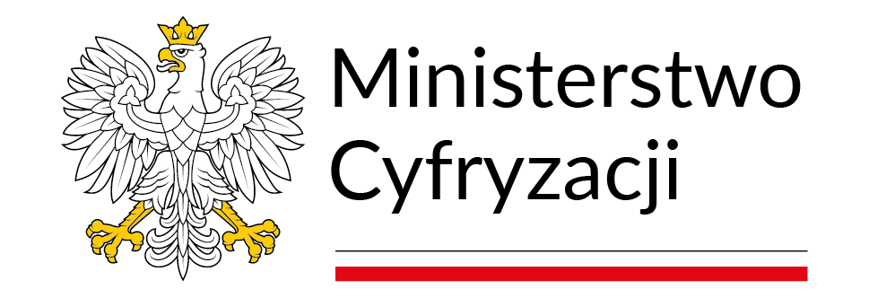
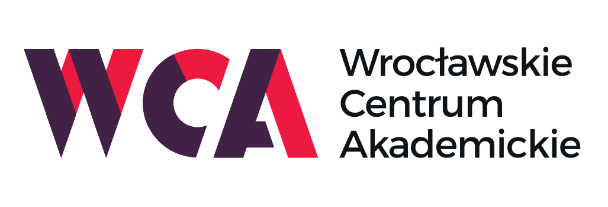

# II Olimpiada Sztucznej Inteligencji / 2nd Polish AI Olympiad

  

Witamy w repozytorium z zadaniami II Olimpiady Sztucznej Inteligencji. Olimpiada ta jest skierowana do uczniów w Polsce, zarówno ze szkół średnich jak i podstawowych, którzy są zainteresowani sztuczną inteligencją. Celem jest zwiększenie zainteresowania AI i wyłonienie składów reprezentacji na olimpiady międzynarodowe [IOAI](https://ioai-official.org/) w Pekinie (2-9 sierpnia 2025) i [IAIO](https://www.iaio-official.org/) w Lublanie.

## Informacje ogólne
**Strona główna:** [Olimpiada Sztucznej Inteligencji](https://oai.cs.uni.wroc.pl/edycje/ii-oai)

Druga edycja Olimpiady odbędzie się w trzech etapach:
- Pierwszy etap, online, 17.02 - 22.03.2025. 
- Drugi etap, regionalny w 4 miastach: Kraków, Poznań, Warszawa i Wrocław, 26 - 27.04.2025 
- Trzeci etap, finał we Wrocławiu, 30.05 - 02.06.2025. 

Regulamin jest dostępny na naszej [stronie](https://oai.cs.uni.wroc.pl/regulamin).

Oficjalnym kanałem komunikacji z uczestnikami będzie platforma Discord. Dostęp do niej otrzymują uczestnicy po dokonaniu rejestracji.

## Zadania
W ramach pierwszego etapu Olimpiady uczestnicy zmierzą się z następującymi wyzwaniami:
1. **Maszynka do Liczenia Monet** - Detekcja monet z wykorzystaniem modeli wizyjnych.
2. **Wykrywanie Halucynacji** - Wykrywanie halucynacji modeli językowych w odpowiedziach na pytania.
3. **Wykrywanie Zaburzeń Sygnału EKG** - Wykrywanie anomalii w danych EKG.
4. **Zaszumienie w Etykietach Danych** - Trenowanie modeli z zaszumionymi etykietami.
5. **Ukryte Podciągi** - Identyfikacja zależności w binarnych ciągach znaków.

## Sposób oddawania zadań
Uczestnicy będą rozwiązywać zadania samodzielnie i przesyłać je do Komitetu Merytorycznego za pomocą Platformy Konkursowej. Dostęp do niej jest udostępniany uczestnikom po rejestracji. Każde zadanie będzie wymagało przesłania pliku Jupyter Notebook z rozwiązaniem. Wszystkie prace będą oceniane automatycznie na Platformie Konkursowej.

## Środowisko
Lista dopuszczalnych pakietów znajduje się w pliku `environment.yml`, osobno dla każdego zadania. Rozwiązania były testowane przy użyciu Pythona 3.11. Na potrzeby pracy nad zadaniami, zalecamy wykorzystanie środowiska online [Google Colab](https://colab.google/). lub stworzenie środowiska lokalnego z wykorzystaniem [Anacondy](https://docs.anaconda.com/) (instrukcję instalacji środowiska z pliku YML znajdziesz [tutaj](https://docs.conda.io/projects/conda/en/latest/user-guide/tasks/manage-environments.html#creating-an-environment-from-an-environment-yml-file)).

> Uwaga: To samo rozwiązanie uruchomione w środowisku lokalnym lub Google Colab może zwracać inne wyniki niż na Platformie Konkursowej. Ostateczna ocena Twojego zadania zostanie wyliczona na Platformie Konkursowej.

## Kryteria oceny
Oceny za zadania zostaną wyliczone na podstawie podanych w treściach zadań kryteriów. Za każde zadanie w pierwszym etapie uczestnicy mogą zdobyć maksymalnie 100 punktów.

## Licencje
Repozytorium korzysta z następujących zasobów objętych licencjami:
- [**ChatGPT**](https://openai.com/policies/terms-of-use/) - obrazy w zadaniach 2, 3 i 5, pytania ze zbioru danych w zadaniu 2.
- [**OpenArt.ai**](https://openart.ai/terms/) - obraz w zadaniu 4.
- [**Flux**](https://github.com/black-forest-labs/flux/blob/main/model_licenses/LICENSE-FLUX1-dev) - obraz w zadaniu 1.
- [**Gemma**](https://github.com/google-deepmind/gemma?tab=Apache-2.0-1-ov-file) - odpowiedzi na pytania ze zbioru danych w zadaniu 2.
- [**Google Gemini**](https://ai.google.dev/gemini-api/terms) - zbiór danych w zadaniu 3, który następnie uległ modyfikacjom.
- [**MedMNIST**](https://medmnist.com/) - zbiór danych w zadaniu 4, który następnie uległ modyfikacjom.

## Kontakt
W razie pytań lub wątpliwości, prosimy o kontakt przez platformę Discord lub e-mail: [oai@cs.uni.wroc.pl](mailto:oai@cs.uni.wroc.pl).

Życzymy powodzenia w rozwiązywaniu zadań!

## Partnerzy instytucjonalni 

  
  

